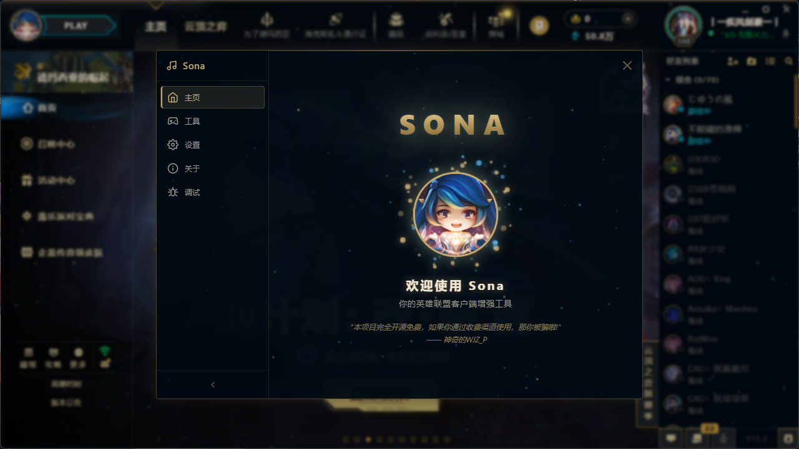

## A League of Legends Client Enhancement Plugin for Pengu Loader

<div align="center">

  <a href="https://github.com/WJZ-P/sona/graphs/contributors">
    
  </a>
  &nbsp;
  <a href="https://github.com/WJZ-P/sona/network/members">
    
  </a>
  &nbsp;
  <a href="https://github.com/WJZ-P/sona/stargazers">
    
  </a>
  &nbsp;
  <a href="https://github.com/WJZ-P/sona/issues">
    
  </a>
  &nbsp;
  <a href="https://github.com/WJZ-P/sona/blob/main/LICENSE">
    
  </a>

</div>

<br>

<p align="center">
  <a href="https://github.com/WJZ-P/sona/">
    
  </a>
</p>

<h1 align="center">Sona</h1>

<p align="center">
  <a href="README.md">简体中文</a>
  ·
  English
  <br>
  <a href="#installation">Quick Start</a>
  ·
  <a href="https://github.com/WJZ-P/sona/issues">Report Bug</a>
  ·
  <a href="https://github.com/WJZ-P/sona/issues">Request Feature</a>
</p>

<p align="center">
  
</p>

<p align="center"><em>Open Sona from the icon beside the Play button, or press F1 at any time.</em></p>

## Table of Contents

- [Introduction](#introduction)
- [Features](#features)
- [Screenshots](#screenshots)
- [Installation](#installation)
- [Usage](#usage)
- [Architecture](#architecture)
- [Notes](#notes)
- [Development](#development)
- [License](#license)
- [Acknowledgements](#acknowledgements)
- [Important Notice](#important-notice)

## Introduction

Sona is a free and open-source League of Legends client enhancement plugin built on top of [Pengu Loader](https://pengu.lol/). It runs inside the League Client Chromium environment and communicates with the client through LCU REST APIs and WebSocket events.

Sona focuses on practical quality-of-life improvements: champion select tools, match history lookup, OP.GG build recommendations, lobby and social enhancements, client beautification, custom avatars, replay tools, and a convenient in-client settings panel.

## Features

### Match and Champion Select

|  | Feature | Description |
|:---:|---|---|
| ⚡ | **Auto Accept** | Automatically accepts queue pop. |
| 🎯 | **Auto Pick / Auto Ban Queue** | Configure multiple candidate champions. Sona skips unavailable champions by priority. |
| 🔄 | **ARAM Bench No Cooldown** | Removes bench swap cooldown in ARAM. |
| 📊 | **Team Power Analysis** | Analyzes teammate recent performance and can send a compact report to champion-select chat. |
| 🌟 | **Champion Select Assist** | Shows teammate win rate, KDA, particles, champion tier badges, and clickable match history. |
| 📈 | **Game Analysis Popup** | Displays team strength analysis after entering game, including win rate, KDA, rank, and premade groups. |
| 🔁 | **Auto Return to Lobby** | Returns to lobby after a game, with optional auto queue and retry logic. |
| 🛡️ | **Balance Buff Tooltip** | Shows mode-specific champion balance modifiers in ARAM and other supported modes. |
| 👍 | **Auto Honor** | Randomly honors teammates after the game. |
| 🧩 | **Lobby Enhancement** | Click lobby member avatars for match history and show recent performance above banners. |

### Smart Builds

|  | Feature | Description |
|:---:|---|---|
| 🧠 | **Smart Builds, Runes and Summoner Spells** | Automatically syncs item sets after champion lock-in and remembers manually saved runes and spells per champion/mode. |
| 🧰 | **OP.GG Recommendation Panel** | Shows recommended items, runes, summoner spells, augments, and matchups during champion select. |
| 📦 | **Managed Item Sets** | Creates Sona-managed client item sets while preserving user-created item sets. |

### Match History

|  | Feature | Description |
|:---:|---|---|
| 🔍 | **Player Lookup** | Search any player by Riot ID. |
| 🏷️ | **Mode Filter** | Filter match history by queue using SGP query tags. |
| 📋 | **Match Details** | View champions, KDA, items, runes, spells, CS, gold, damage, map, and time. |
| 📎 | **Game ID Copy** | Copy Game ID for replay tools. |

### Social

|  | Feature | Description |
|:---:|---|---|
| ✏️ | **Unlock Status Message** | Removes the client-side lock from status editing. |
| 🖼️ | **Custom Profile Background** | Use any skin as your profile background, with search and lazy loading. |
| 🎏 | **Custom Banner** | Locally display any challenge banner. |
| 👥 | **Premade Friend Marker** | Marks friends in the same premade with matching colors. |
| ⏱️ | **Enhanced Friend Status** | Shows in-game friends' mode and elapsed game time in the social sidebar. |
| 🎭 | **Rank Disguise** | Disguise the rank shown in friend cards. |
| 🚫 | **Remove Crest** | Remove profile crest decoration. |
| 🧹 | **Reset Avatar** | Restore the default client avatar. |

### Beautify

|  | Feature | Description |
|:---:|---|---|
| 🎨 | **Beautify Page** | A dedicated page for client visual customization. |
| 🖼️ | **Custom Home Wallpaper** | Use images or videos from `assets` as the home background. Supports blur, tint, crop, and positioning. |
| 🎲 | **Random Wallpaper** | Randomly applies one wallpaper on each client start while avoiding immediate repeats when possible. |
| 🧑‍🎤 | **Custom Avatars** | Manage multiple local avatar assets, switch with one click, and sync avatars to friends through hidden zero-width status payloads. |
| 🌈 | **Theme Color** | Change the global client `--default-color` variable and reset it at any time. |
| 📦 | **Asset Manager** | Records paths under `assets` and can normalize absolute paths containing `sona/assets`. |

### Tools and Interface

|  | Feature | Description |
|:---:|---|---|
| 🎬 | **Replay Tool** | Download and watch replays by Game ID. |
| 💾 | **Settings Backup** | Back up and restore client settings by account. |
| 🪟 | **Window Effects** | Blur, acrylic, mica, and other visual effects depending on platform support. |
| ✨ | **Global Particles** | Adds star-like particles to the client background. |
| 📱 | **Enhanced Availability** | Supports extra statuses such as offline and mobile, with startup restore. |
| 🌐 | **Internationalization** | Supports Simplified Chinese, English, and automatic language detection. |
| 🔧 | **Debug Panel** | LCU API, chat, replay, OP.GG, language, and asset debugging tools for advanced users. |

## Screenshots

### Champion Select Assist

<p align="center">
  
</p>

### Champion Tier Badges

<p align="center">
  
</p>

### Build Recommendations

<p align="center">
  
</p>

### Augment Recommendations

<p align="center">
  
</p>

### Lobby Enhancement

<p align="center">
  
</p>

### Enhanced Friend Status

<p align="center">
  
</p>

## Installation

### Requirements

- Latest [Pengu Loader](https://pengu.lol/)
- League of Legends client

### Steps

1. Install Pengu Loader from the [Pengu Loader releases](https://github.com/PenguLoader/PenguLoader).
2. Start Pengu Loader and make sure it shows `ready`.
3. Download the Sona release package from this repository's Releases page. Do not use the source-code archive as a plugin package.
4. Open the Pengu Loader plugins folder.
5. Extract the `sona` folder from the release package into the plugins folder.
6. Refresh Pengu Loader and restart the League client.

The installed `sona` folder should contain the built `index.js` and `index.css` files.

## Usage

1. Start the League client.
2. Click the Sona icon beside the Play button, or press `F1`.
3. Configure features in the Tools, Beautify, and Settings pages.
4. Settings are saved automatically and restored on next launch.

## Architecture

```text
League Client (Ember.js + Chromium)
        |
Pengu Loader
        |
Sona Plugin
        |
React UI + Feature Modules + DOM Injections
        |
LCU REST APIs / WebSocket Events / DataStore
```

Core modules:

- `LCUManager`: wraps LCU REST APIs and WebSocket events.
- `InjectorManager`: keeps DOM injections alive through client re-renders.
- `SonaStore`: typed configuration, DataStore persistence, and change listeners.
- Feature modules: independent lifecycle units for auto accept, OP.GG builds, custom avatars, lobby enhancement, and more.
- Lightweight i18n: dictionary-based Chinese/English translations with automatic client-language detection.

## Notes

1. Sona requires Pengu Loader and cannot run standalone.
2. Sona communicates with the League Client through LCU APIs. It does not modify game files or inject into the game process.
3. Custom avatars use user-selected local assets, ImgBB upload, hidden zero-width status payloads, and local friend-cache fallback for offline friends.
4. Some features depend on client state, region, queue type, or third-party API availability and may not always return data.
5. Rank disguise only affects friend-card display and does not alter real ranked data.

## Development

```bash
npm install
npm run dev
npm run build
```

Project structure:

```text
sona/
├── src/
│   ├── index.tsx
│   ├── App.tsx
│   ├── i18n/
│   ├── lib/
│   │   ├── lcu.ts
│   │   ├── features.ts
│   │   ├── features/
│   │   ├── store.ts
│   │   ├── injections.ts
│   │   ├── InjectorManager.ts
│   │   └── assets.ts
│   ├── components/
│   ├── styles/
│   └── types/
├── assets/
├── markdown/
├── CHANGELOG.md
├── pengu.d.ts
├── package.json
└── LICENSE
```

## License

This project is licensed under AGPL-3.0. See [LICENSE](LICENSE) for details.

## Acknowledgements

Sona learned a lot from the League client plugin community. Special thanks to:

- [BakaFT / BetterTencentLCU](https://github.com/BakaFT/BetterTencentLCU)
- [imunproductive / upl](https://github.com/imunproductive/upl)
- [BakaFT / CustomHookLoader](https://github.com/BakaFT/CustomHookLoader)
- [nomi-san / balance-buff-viewer](https://github.com/nomi-san/balance-buff-viewer)
- [LeagueAkari / LeagueAkari](https://github.com/LeagueAkari/LeagueAkari)

## Important Notice

> This project does not accept sponsorship.
>
> This project does not accept Pull Requests.
>
> Feedback, ideas, and bug reports are welcome through [Issues](https://github.com/WJZ-P/sona/issues).

## If Sona helps you, please consider giving the project a star.

[](https://starchart.cc/WJZ-P/sona)
